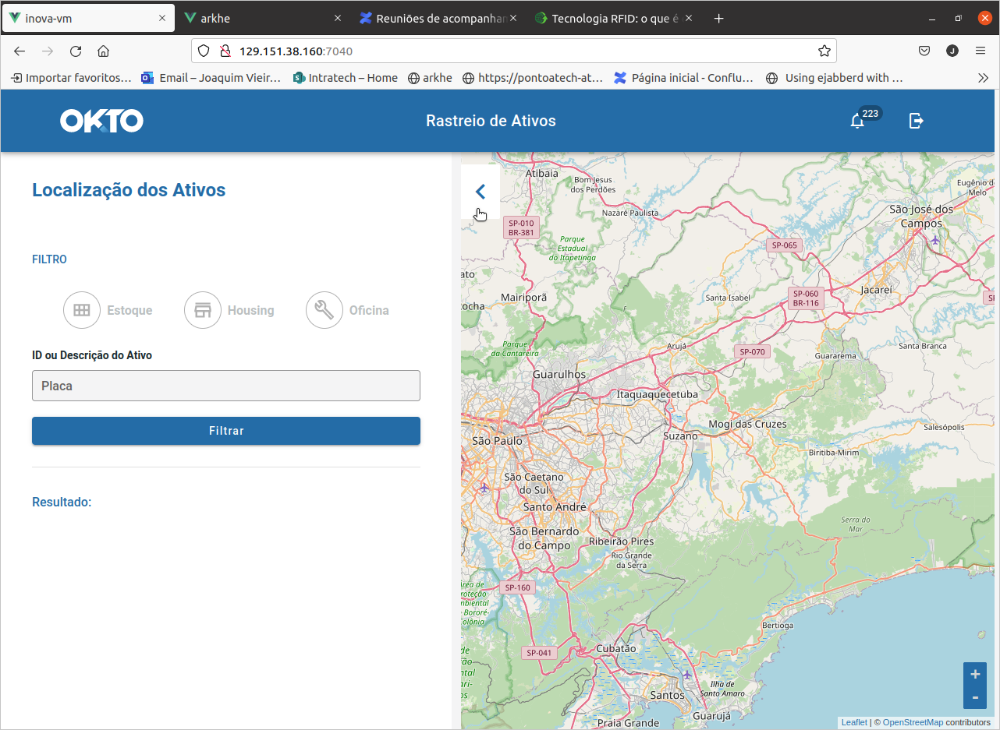

#  Índice

* 1 [Introdução](#intro) 

* 2 [Comandos Básicos](#basicCommands)

  * 2.1 [Início](#homePage)

  * 2.2 [Modo Localização dos Ativos](#viewMode)

    * 2.2.1 

#  1.Introdução

A Demonstração de Tecnologia do Sistema de Gestão e Controle de Ativos possibilita demonstrar através de um sistema integrado, a identificação, a contagem e o rastreamento dos ativos, assim podendo identificar individualmente cada ativo, registrando todas as informaçõe técnicas e a sua localização, garantindo o uso correto dos ativos e podendo auxiliar no inventário.

[Voltar ao Topo](#index)

#  2.Comandos Básicos

Para navegar a Demonstração de Tecnologia do Sistema de Gestão e Controle de Ativos é possível utilizar os seguintes comandos listados abaixo.

##  2.1.Início

<figure id="figViewHome">
	
	<figcaption>Fig. 2.1: Visualização da home. </figcaption>
</figure>

##  2.2.Localização dos Ativos

Para visualizar o modo de **_Localização dos Ativos_** clique no botão para expandir a aba. É possível visualizar as principais ferramentas conforme a figura:

<figure id="figViewHome">
	
	<figcaption>Fig. 2.1: Localização dos Ativos. </figcaption>
</figure>

###  2.2.1.Visualização das localidades 

Com a  Visualização das localidades, [Figura 2.1](#figViewHome), é possível localizar um ativo através do seu ID ou Descrisão do Ativo, através do filtro

